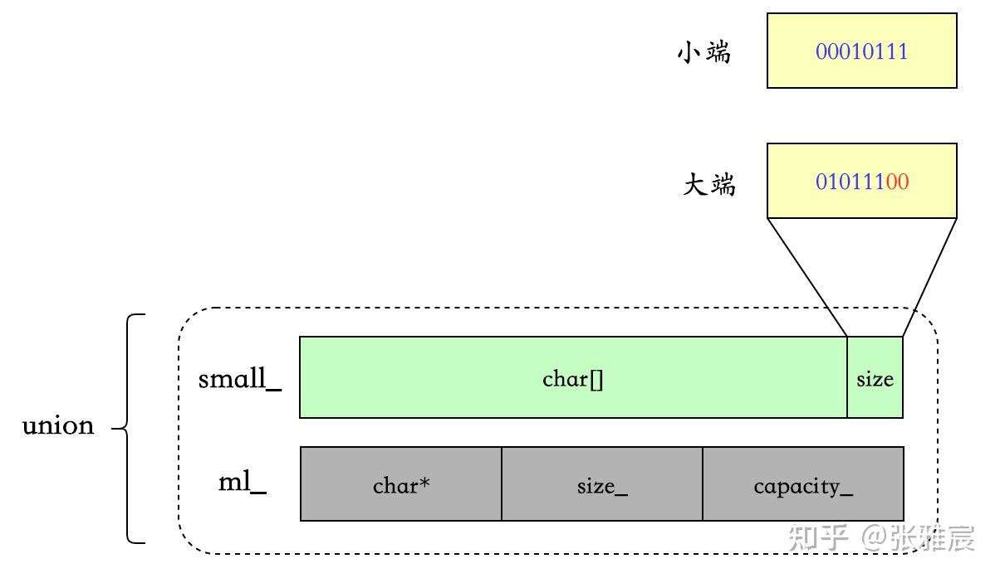

<!--
 * @Author: your name
 * @Date: 2021-02-06 22:04:35
 * @LastEditTime: 2021-02-06 22:17:31
 * @LastEditors: Please set LastEditors
 * @Description: In User Settings Edit
 * @FilePath: /folly/learn/fdstring.md
-->

small strings 存放的 size 不是真正的 size，是maxSmallSize - size，这样做的原因是可以 small strings 可以多存储一个字节 。因为假如存储 size 的话，small中最后两个字节就得是'\0' 和 size，但是存储maxSmallSize - size，当 size == maxSmallSize 时，small的最后一个字节恰好也是 '\0'。

为了兼容C字符串，字符串必须以'\0'结尾，当字符串长度小于最大长度时，后面的空间为'\0'，能兼容C 和std::string。如果 字符串占满时，最后一字节必须也为'\0'，否则必须多加一字节才能兼容。因此这里采用了 maxSmallSize - size 的方式存储长度，同时 small 的标志符也为00，因此数据为最大时，末尾一字节恰好为'\0'，则完美兼容。
